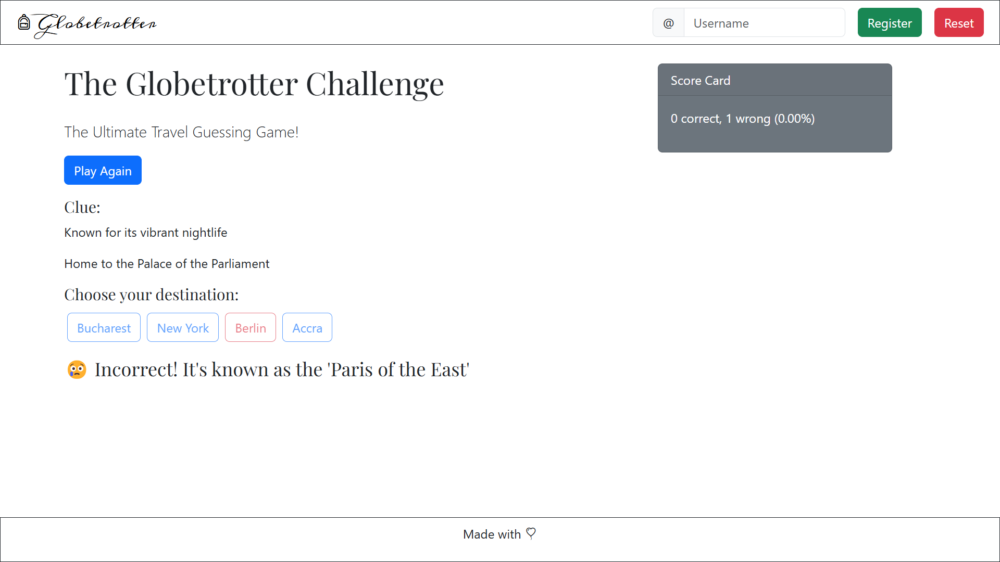
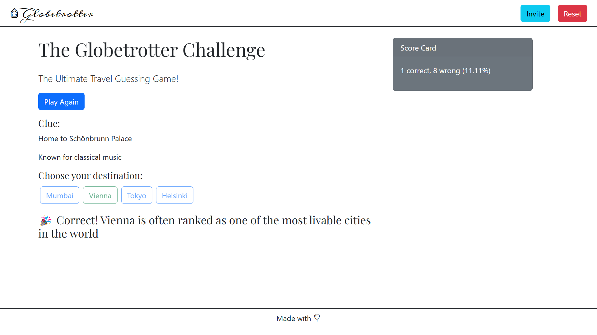
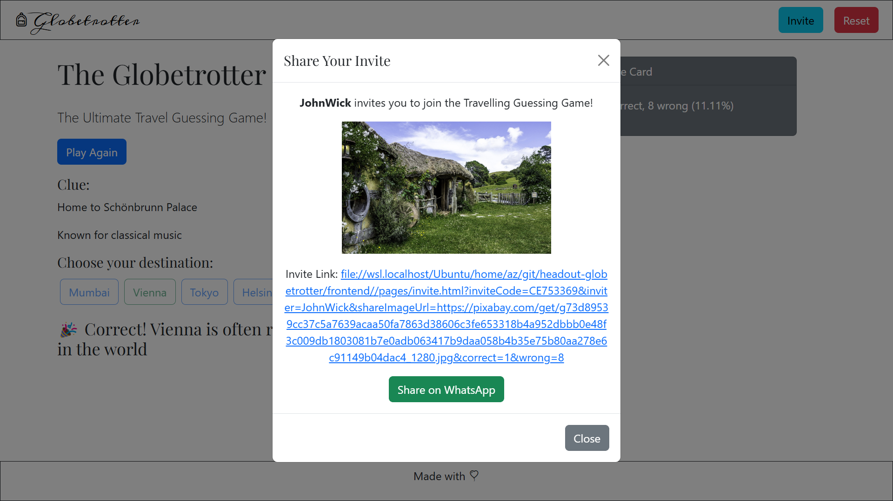
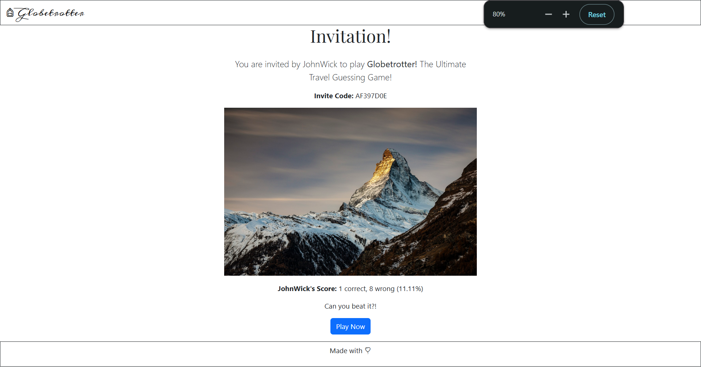
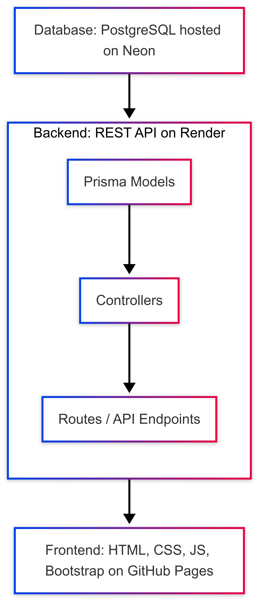

# The Globetrotter Challenge!

## Introduction

### Info

**The Globetrotter Challenge** is *The Ultimate Travel Guessing Game!*

An interactive web based game, where users are presented with cryptic clue(s) of a destination and they have to guess it.

[Seet it Live!](https://4bdullah7eeshan.github.io/headout-globetrotter)

### Screenshots


---


---



---



---



---



---

### Features Overview

- Play as a guest
- Register with a unique username
- Tracking of correct and wrong answers
- Score calculation
- Storage of game data between reloads
- Reset the game by playing as a new guest
- Share/Invite the game via WhatsApp

### Repo Structure

This repo houses the source code of the Full Stack Web App for this game serving as a mono repo for both the backend and the frontend each in their own dedicated separate folders.

### Background

This challenge was presented as part of [Headout](https://www.headout.com/)'s take home assignment for the Software Engineer, Backend position.

## Getting Started

### Clone Repository

```
git clone git@github.com:4bdullah7eeshan/headout-globetrotter.git
cd headout-globetrotter
```
### Install Dependencies

```
npm install
```

### Setup Environment Variables

```
DATABASE_URL="postgresql://<owner>:<PG_PORT>/<db>?sslmode=require"
SESSION_SECRET="<>"
PORT=<>
PIXABAY_API_KEY="<>"
OPENAI_API_KEY="<>"
```

### Start Server

```
node app.js
```

## Tech Stack

### Backend

- [Node.js](https://nodejs.org/) (Run-time environment)
- [Express](https://expressjs.com/) (Framework)
- [PostgreSQL](https://www.postgresql.org/) (Relational Database)
- [Prisma](https://www.prisma.io/) (ORM)

### Frontend

I went with a light weight frontend tech stack relying on vanilla HTML, CSS, and JavaScript.

- [HTML](https://html.spec.whatwg.org/): Markup
- [Bootstrap](https://getbootstrap.com/): CSS Framework for styling
- [JavaScript](https://developer.mozilla.org/en-US/docs/Web/JavaScript): Dynamic & Functionality
- [CSS](https://www.w3.org/Style/CSS/): Styling, although I didn't use much of it

### External API Integrations

- [Pixabay API](https://pixabay.com/api/docs/): To generate images
- [Open AI API](https://platform.openai.com/): Prompting info for dataset generation
- [WhatsApp API](https://api.whatsapp.com/): To share invite link through WhatsApp

### Deployment

- [Render](https://render.com/): Backend deployment
- [GitHub Pages](https://pages.github.com/): Frontend deployment
- [Neon](https://neon.tech/): Database

## Architecture Design




---

## API

I created REST API to establish a scalable and flexible interaction between the frontend and the backend.

The endpoints are grouped into three main sections: Rounds, Users, and Profiles.

### Rounds

#### `GET /rounds/new`

##### Description

Creates and returns a new game round for a given user. A round includes one or two random clues from a destination and multiple answer options.

##### Query Parameters

`userId` (required): The unique identifier of the user (guest or registered) playing the game.

##### Request Body Example

```
GET /api/rounds/new?userId=1
```

##### Response Example (JSON)

```json
{
  "roundId": 10,
  "clue": [
    {
      "id": 55,
      "description": "This city is famous for its sparkling tower at night."
    }
  ],
  "options": [
    { "id": 1, "name": "Paris" },
    { "id": 2, "name": "London" },
    { "id": 3, "name": "Tokyo" },
    { "id": 4, "name": "New York" }
  ]
}
```

#### `POST /rounds/:roundId/answer`

##### Description
Submits the user's answer for a particular round. The endpoint checks the answer, returns feedback, updates the user’s score, and provides the correct answer id.

##### URL Parameters

`roundId` (required): The identifier of the round.

##### Request Body Example (JSON)

```json
{
  "userAnswerId": 3
}
```

##### Response Example (JSON)

```
{
  "correct": false,
  "correctAnswerId": 1,
  "feedback": "😢 Incorrect! Paris was saved for radio transmissions.",
  "updatedScore": {
    "numberOfCorrectAnswers": 4,
    "numberOfWrongAnswers": 2,
    "percentage": "66.67"
  }
}
```

###### NOTES

- If the answer is correct, the response’s correct field is true, and the selected button should be outlined in green.
- If the answer is incorrect, the selected button is outlined in red while the correct answer button is outlined in green.

### User Endpoints

#### `POST /users/create-guest`

##### Description
Creates a new guest user with default values. This endpoint is used when a new visitor first arrives and no guestUserId is found in localStorage.

##### Request Example:

```
POST /api/users/create-guest
```

##### Response Example (JSON):

```json
{
  "userId": 1
}
```

###### Notes

- The `userId` returned is an auto-incremented integer that is stored in `localStorage` on the client.

#### `GET /users/:userId/score`

##### Description

Retrieves the current score of the user.

##### URL Parameters

`userId` (required): The unique identifier of the user.

##### Request Example

```
GET /api/users/1/score
```
##### Response Example (JSON)

```json
{
  "userId": 1,
  "numberOfCorrectAnswers": 4,
  "numberOfWrongAnswers": 2,
  "percentage": "66.67"
}
```

### Profiles Endpoints

#### `POST /profiles/register`

##### Description

Registers a guest as a full (registered) user by creating a Profile. This endpoint “promotes” the guest by linking an existing User record to a new Profile.

##### Request Body (JSON)

```json
{
  "username": "cool_traveler",
  "guestUserId": 1
}
```

##### Response Example (JSON)

```json
{
  "profileId": 5,
  "username": "cool_traveler"
}
```

###### Notes

- Once registered, the `profileUsername` is stored in `localStorage`.
- The UI then hides the registration form and shows the invite/share buttons instead.

#### `POST /profiles/:username/invite`

##### Description

Generates a dynamic invitation for the registered user. The endpoint creates an invite code and returns an invite link (pointing to the frontend share page), a dynamic share image URL (from Pixabay), and a WhatsApp share link.

##### URL Parameters

`username` (required): The unique username of the registered user.

##### Request Example

```
POST /api/profiles/cool_traveler/invite
```

##### Response Example (JSON)

```json
{
  "inviteCode": "ABCD1234",
  "inviteLink": "https://yourusername.github.io/your-app/invite.html?inviteCode=ABCD1234&inviter=cool_traveler&shareImageUrl=https%3A%2F%2Fpixabay.com%2F...jpg",
  "shareImageUrl": "https://pixabay.com/...",
  "whatsappLink": "https://api.whatsapp.com/send?text=Join%20me%20on%20the%20Travelling%20Guessing%20Game!%20Use%20my%20invite%20link:%20https%3A%2F%2Fyourusername.github.io%2Fyour-app%2Finvite.html%3FinviteCode%3DABCD1234%26inviter%3Dcool_traveler%26shareImageUrl%3Dhttps%253A%252F%252Fpixabay.com%252F...",
  "inviter": {
    "username": "cool_traveler",
    "score": {
      "numberOfCorrectAnswers": 4,
      "numberOfWrongAnswers": 2
    }
  }
}
```

###### Notes

- The `inviteLink` points to the frontend share/invite page.
- The whatsappLink contains the text and URL to share via WhatsApp.
- The response includes the inviter’s score so that the invited friend can see it before joining.


